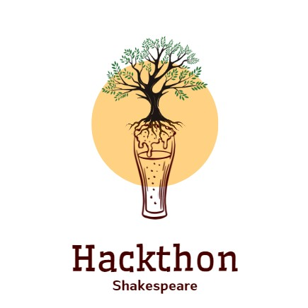

# Evolving Beasts

A brief summary of the project
---

**[Evolving Beasts](https://lin.ee/gEbeKQV)**, the **LINE BOT** supernova that seamlessly blends ***gaming, quests, nurturing, AI, and sustainability concepts***.

| [Weather Shakespeare](https://weather-shakespeare.github.io/) |Evolving Beasts - LINE QRCODE |
|:-:|:-:|
| |  |

License
---
Released under [MIT](./LICENSE) by [@1chooo](https://github.com/1chooo), [@Weather-Shakespeare](https://github.com/Weather-Shakespeare).

This software can be modified and reused without restriction.
The original license must be included with any copies of this software.
If a significant portion of the source code is used, please provide a link back to this repository.