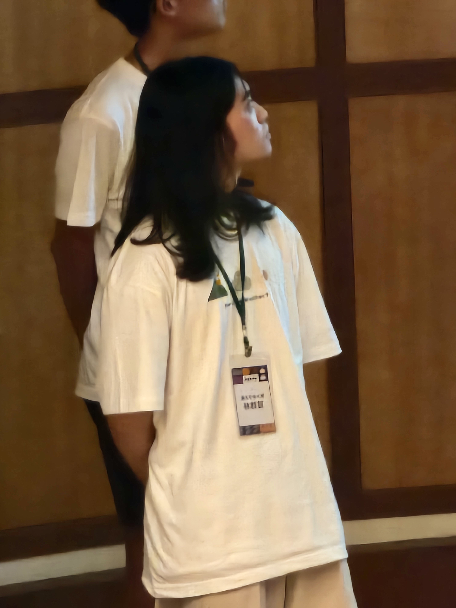

# Thought 

I am delighted to announce the successful conclusion of a three-month #WeatherHackathon, where we secured the second place and received the Sustainable Excellence Award. I'm immensely grateful to WeatherRisk 天氣風險管理開發公司 for organizing this event and to ChiMing Peng for introducing me to it during our class. This opportunity allowed me to collaborate with peers from various fields in the hackathon.

Throughout the competition, I took on the role of a #softwaredeveloper, working to turn our creative ideas into a user-friendly product that aligns with #sustainability and #opensourcesoftware values. Our product, named "Hey! How's That Monster Growing so Big?", aims to promote individual environmental responsibility. To achieve this, we designed a LINE Bot integrated with #machinelearning-based image recognition technology for waste sorting. The bot features a monster growth system, encouraging users to engage in eco-friendly practices. I'll be sharing the link to my GitHub repo and the LINE BOT in my post, inviting everyone to join in. I plan to continuously update and enhance this service, ensuring the concept of sustainability becomes an integral part of everyone's lives.

Lastly, a big thank you to the "Weather Hackathon Shakespeare" team for the opportunity to collaborate and achieve remarkable results together!

---

GitHub Repo: https://github.com/1chooo/evolving-beasts

LINE Bot URL: https://lin.ee/5BK5hnu

Picture
---

| | |
|-|-|
|| |

Linkedin
---
I am delighted to have participated in the Weather Hackathon on August 15th and to have secured second place along with the Sustainable Excellence Award. All of this is thanks to the organization by Weather Risk Company and Dr. Peng's initial recommendation.

Looking back on the past three months of hard work, I remember willingly stepping up on the first day of the event to share the open-source spirit of the hackathon. I introduced the use of GitHub, and our team, "Weather Hackathon Shakespeare," held onto this value throughout. We remained committed to open-source principles while integrating sustainability, machine learning, and addressing real-life scenarios. This led to the development of our product – "Hey! How's That Monster Growing so Big?"

Our product, as mentioned earlier, aims for sustainability. We aspire to encourage individual recycling efforts, and thus, we created an image recognition system. We integrated it into the everyday social platform LINE, making it more convenient for everyone to use. In my post, I will share the link to my GitHub repository and the LINE BOT, inviting everyone to join. I intend to continuously update and improve this service, making sustainability an inseparable aspect of people's lives.

Lastly, a heartfelt thank you to the "Weather Hackathon Shakespeare" team for the collaborative opportunity and for achieving outstanding results together!

---

GitHub Repo: https://github.com/1chooo/evolving-beasts

LINE Bot URL: https://lin.ee/5BK5hnu